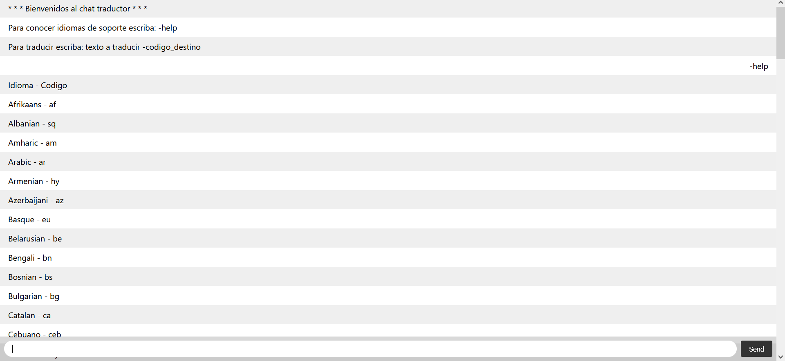
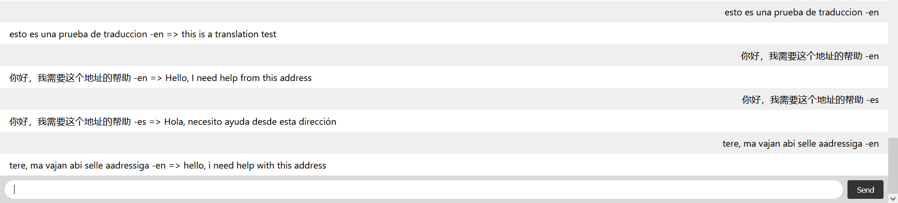

# NodeJS + Socket.io + Google Translate API

Se tiene un servicio que ayuda con la traduccion de texto utilizando la API de Google Translate.

Existe una lista de idiomas soportados la cual se la consume de Google Translate y se le muestra al usuario utilizando la secuencia de texto:

```sh
-help
```
 Para traducir se utiliza la siguiente secuencia de texto, el idioma origen es detectado automaticamente y solo debemos preocuparnos por elegir el idioma destino.
```sh
texto a traducir -codigo_idioma_destino
```

## Instalar dependencias

```bash
npm install --save
```

## Ejecutar con Node.js

```bash
node app.js
```

## Ruta de ejecución

```bash
http://localhost:3000/
```

## Imagenes de ejecución

Selección de ayuda:



Funcionalidad de traducción:

